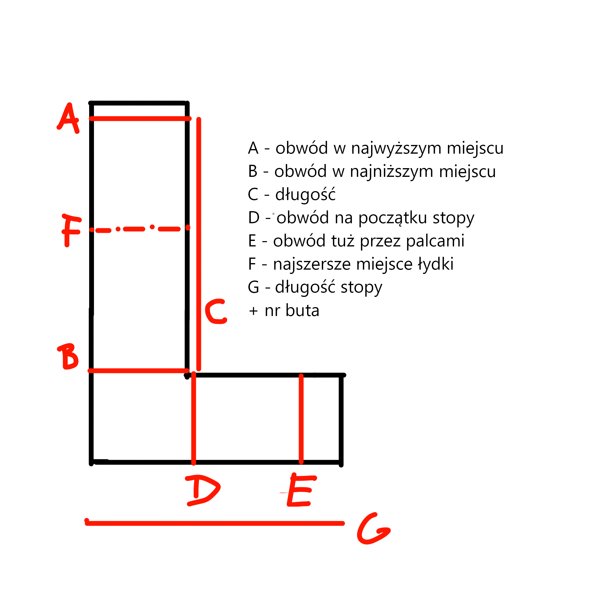
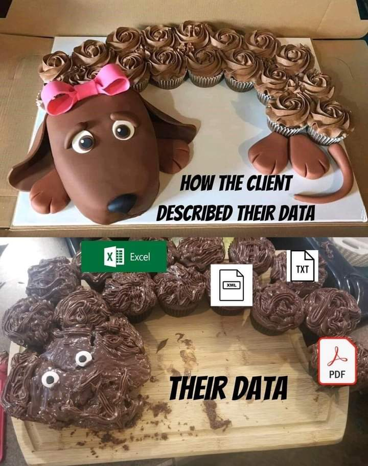

This is a reference file for additional information about Markdown.
Basic information about Markdown use cases are in [Markdown The Lesser Evil](Markdown_The_Lesser_Evil).

Measuring your foot for custom-made socks:

The dark truth about user data:
